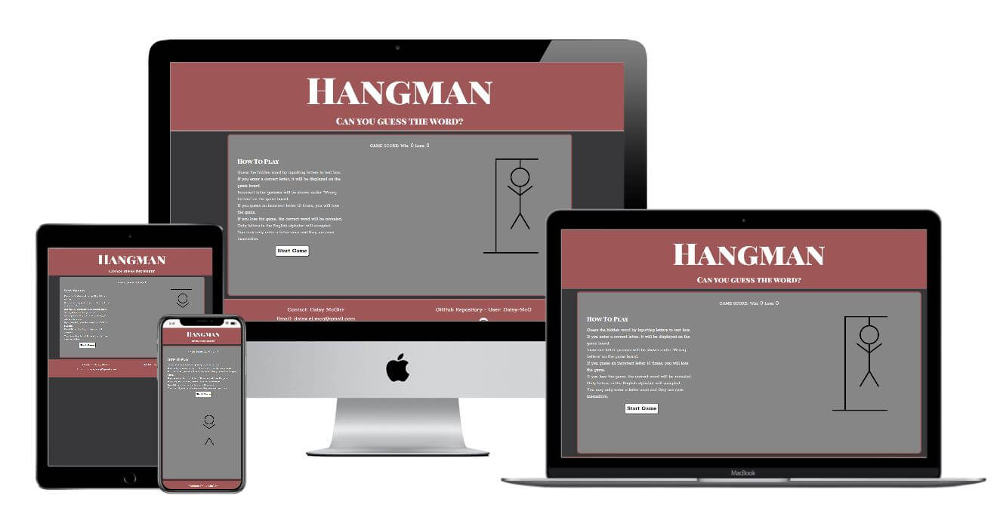
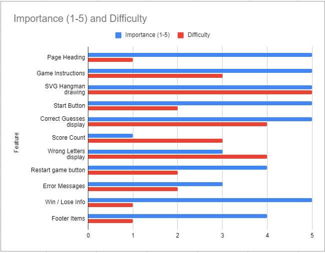
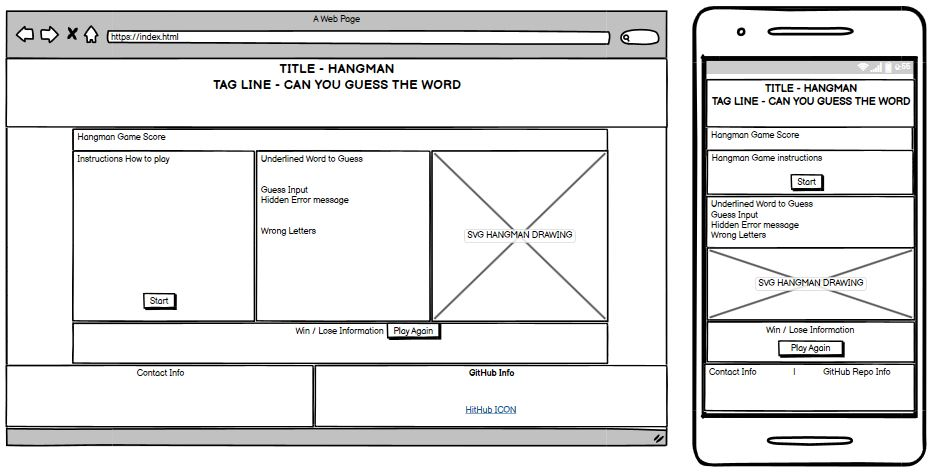
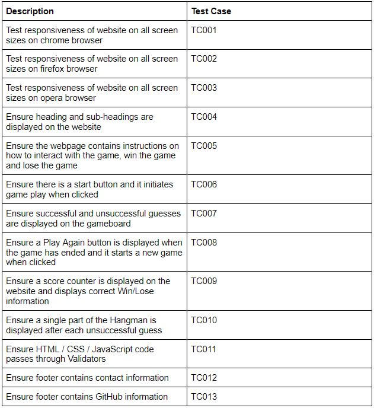
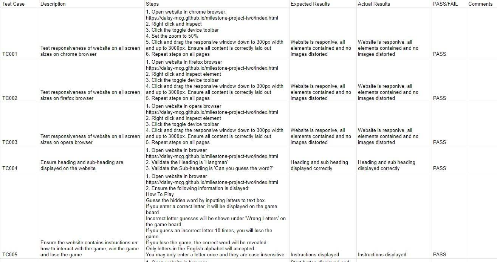

# JavaScript Hangman Game

The live website can be found [here](https://daisy-mcg.github.io/Hangman/)

## Purpose

This Website was created for the sole purpose of completing the second Milestone Project for the Code Institute's Full Stack Developer course. It was built using the knowledge gained from the HTML, CSS, User Centric Design, JavaScript Fundamentals and Interactive Frontend Development modules. A full list of technologies used can be found in the [technologies](#Technologies-Used) section of this document.

## Table of Contents
* [User Experience Design (UX)](#User-Experience-Design)
    * [The Strategy Plane](#The-Strategy-Plane)
        * [User stories](#User-Stories)
    * [The Scope Plane](#The-Scope-Plane)
    * [The Structure Plane](#The-Structure-Plane)
    * [The Skeleton Plane](#The-Skeleton-Plane)
        * [Wireframes](#Wireframes)
    * [The Surface Plane](#The-Surface-Plane)
        * [Design](#Design)
            * [Colour Scheme](#Colour-Scheme)
            * [Typography](#Typography)
            * [Imagery](#Imagery)
    * [Differences to Design](#Differences-to-Design)
- [Features](#Features)
    * [Existing Features](#Existing-Features)
    * [Future Features](#Features-Left-to-Implement)
* [Technologies](#Technologies)
* [Testing](#Testing)
    * [Test Strategy](#Test-Strategy)
    * [Test Results](#Test-Results)
    * [Isses and Resolutions](#Issues-and-Resolutions-to-issues-found-during-testing)
* [Deployment](#Deployment)
    * [Project Creation](#Project-Creation)
    * [GitHub Pages](#Using-Github-Pages)
    * [Locally](Run-Locally)
* [Credits](#Credits)
  * [Content](#Content)
  * [Acknowledgements](#Acknowledgements)

****

## User Experience Design
### **The Strategy Plane**
This website was created to showcase my knowledge of HTML, CSS & JavaScript and to provide users with some entertainment in the form of an online Hangman game created with JavaScript and SVG and jQuery. The game should be easy to understand, simple to interactive with and give feedback to the user on all inputs.

Site Goals:
* To showcase the skills I have learnt in HTML, CSS, JavaScript.
* To provide users with an interactive game to play that has clear Win / Lose Scenarios.
* To create an enjoyable, interactive game that makes the user want to stay and play again.
* To create a game that makes the user want to return to the website.

#### User stories
* As a user, I want to easily understand the main purpose of the site.
* As a user, I want to view the website and content clearly on any device.
* As a user, I want to have instructions on how to play the game so that I can easily understand the rules.
* As a user, I want to be able to start a game when I am ready.
* As a user, I want to see a hangman image appear as I guess incorrectly.
* As a user, I want to know whether my guess was successful or not.
* As a user, I want a way to start a new game when the current game has ended.
* As a user, I want to see my score so that I know how many games I have won or lost.
* As a user, I want to see contact information for the site owner incase I want to reach out with any queries I have about the site.
* As a user, I want to see other work the site owner has created.

### **The Scope Plane**
Features planned:
* Page Heading - A page heading that has a clear caption what the page is about.
* An interactive Hangman Game.
* Game Instructions - Clear instructions on how to play the game.
* An SVG drawing of Hangman.
* Start Button.
* Correct Guesses displayed.
* Score Count.
* Wrong Letters displayed.
* Restart Game button.
* Error messages with incorrect guesses.
* Win / Lose information.
* Footer Items - Contact Information and link GitHub Profile / Repository.

**Feature Importance/Effort**  

### **The Structure Plane**

User Story:
> As a user, I want to easily understand the main purpose of the site.
 
 Acceptance Criteria:
* Header displayed with text 'Hangman'
* Sub heading displayed with text 'Can you guess the word?'

Description: 
There will be a page heading added that reads 'HangMan' with a tag line below it reading 'Can you guess the word?'. This will enable the users to immediately see what the site is about as soon as they enter.

User Story:
> As a user, I want to view the website and content clearly on any device.
 
 Acceptance Criteria:
 * Website layout is well displayed and readable across all sized devices.

Description: 
Bootstrap will be used to lay the content of the Website out in containers, rows and columns. Mobile first design will be used when coding the project and testing will be required to ensure the layout is clear on all devices. No elements should overlap their containers and all items should be responsive so that no elements are too large to display properly.

User Story:
> As a user, I want to have instructions on how to play the game so that I can easily understand the rules.
 
 Acceptance Criteria:
 * Game Instructions are provided that contain the following information:
    * How to interact with the game.
    * How to win the game.
    * How to lose the game.

Description: 
Information to be included:
A full set of game instructions will be added to the game board. This will display to the user, information on how to input guesses, what inputs are accepted, how to win or lose the game. 
Incorrect letter guesses will be shown under 'Wrong Letters' on the game board to that the user can see what letters have already been used. 
If you lose the game, the correct word will be revealed to ensure the user is able to see what the answer was. 
Only letters in the English alphabet will accepted as the words will be written in English. 
You may only enter a letter once as words with duplicate letters will be counted as one guess. 
User input letters are case insensitive.

User Story:
> As a user, I want to be able to start a game when I am ready.
 
 Acceptance Criteria:
 * User can initiate game play

Description: 
A button will be added to the game board to allow the user to start a game.

User Story:
> As a user, I want to see a hangman image appear as I guess incorrectly.
 
 Acceptance Criteria:
 * Hangman image is displayed one piece at a time after each unsuccessfull guess.

Description: 
A Hangman image will be drawn using Scalable Vector Grapics. Each part of the image will be it's own element so it can be displayed a single piece at a time. Once all body parts are displayed, the game will end and the user will lose.

User Story:
> As a user, I want to know whether my guess was successful or not.
 
 Acceptance Criteria:
 * Successful letters are displayed
 * Unsuccessful letters are displayed

Description: 
If the user enters a successful guess, the word will be updated with the letter, leaving the remaining unguessed letters blank. 
If the user enters an unsuccessful guess, this will be displayed in the 'Wrong Letters' section of the game board.

User Story:
> As a user, I want a way to start a new game when the current game has ended.
 
 Acceptance Criteria:
 * User has a way to restart the game without refreshing the page.

Description: 
A button will be added to the game board upon completion of the game to allow the user to start a new game. This will generate a new word each time.

User Story:
> As a user, I want to see my score so that I know how many games I have won or lost.
 
 Acceptance Criteria:
 * User Win / Lose scores are displayed on Screen

Description: 
A score section will be added to the page to show the user how many games they have won or lost during their session. This score will only be displayed for the current session. Once the browser is refreshed, the score will reset.

User Story:
> As a user, I want to see contact information for the site owner incase I want to reach out with any queries I have about the site.
 
 Acceptance Criteria:
 * Contact Information displayed in footer.

Description: 
Contact information will be added to the footer. This will contain a name and email for the site owner.

User Story:
> As a user, I want to see other work the site owner has created.
 
 Acceptance Criteria:
 * GitHub Repositry information is displayed
 * GitHub Icon displayed that directs to GitHub Repository

Description: 
GitHub Repositpry information will be displayed in the footer. This should contain the site owners GitHub user name and an icon that when clicked will direct to the owners GitHub page.

### **The Skeleton Plane**
#### Wireframes
Mobile and Desktop view

### **The Surface Plane**
### Design

#### Colour Scheme
Body colour: A Dark Grey 
Text colour: White   
Game Board background colour: A light grey  
Header and Footer background: A shade of light red  

#### Typography
The headers on all pages throughout the Website are using the [Playfair Display SC](https://fonts.google.com/specimen/Playfair+Display+SC) font while the main text is using the [Rokkitt](https://fonts.google.com/specimen/Rokkitt) font.

#### Imagery
No physical images will be used on the site. A Hangman image will be drawn with code by using Scalable Vector Graphics (SVG) to display this on the HTML page.

#### Differences to Design

All features listed in the Structure Plane were implemented as per design.
A custom 404 page was added to the Website that contains an anchor link to allow the user to direct back to the home page if they try to access a page that is not available.

****
## Features

### Existing Features

* Heading and Sub-heading.
* Game Instructions.
* SVG Hangman image.
* Win/Lose Scores.
* User input.
* Buttons to start and re-start game.
* Footer - Contact Information and GitHub Repo Information

### Features Left to Implement

* Game modes: 'Easy' or 'Hard' mode will be added in a future release. Easy mode will start with no figure parts displayed, this will leave 10 guesses. Hard mode will start with the hanging structure already drawn, this will leave 6 guesses.

****
## Technologies
* [HTML](https://en.wikipedia.org/wiki/HTML)
	* This project uses HTML as the main language used to complete the structure of the Website.
* [CSS](https://en.wikipedia.org/wiki/CSS)
	* This project uses custom written CSS to style the Website.
* [JavaScript](https://en.wikipedia.org/wiki/JavaScript)
	* This project uses JavaScript for functionality through the Website, this includes the puzzle game, onclick button functions, use of the Email API and Google Maps APIs.
* [jQuery](https://jquery.com/)
    * jQuery was used throughout the hangman.js file to minipulate css and html properties.
* [Bootstrap](https://getbootstrap.com/)
	* The Bootstrap framework is used throughout this website for layouts and styling. 
* [Google Fonts](https://fonts.google.com/)
	* Google fonts are used throughout the project to import the *Playfair Display SC* and *Rokkitt* fonts.
* [Visual Studio Code](https://code.visualstudio.com/)
	* VS Code is the Integrated Development Environment used to develop the Website.
* [GitHub](https://github.com/)
	* GithHub is the hosting site used to store the source code for the Website and [Git Pages](https://pages.github.com/) is used for the deployment of the live site.
* [Git](https://git-scm.com/)
	* Git is used as version control software to commit and push code to the GitHub repository where the source code is stored.
 * [TinyJPG](https://tinyjpg.com/)
	* TinyJPG is used to reduce the file sizes of images before being deployed to reduce storage and bandwidth.   
* [Google Chrome Developer Tools](https://developers.google.com/web/tools/chrome-devtools)
	* Google chromes built in developer tools are used to inspect page elements and help debug issues with the site layout and test different CSS styles.
* [balsamiq Wireframes](https://balsamiq.com/wireframes/)
	* This was used to create wireframes for 'The Skeleton Plane' stage of UX design.
* [CSS Generator](https://cssgenerator.org/rgba-and-hex-color-generator.html)
    * This was used to convert the RGBA colour for the site to Hex. 
* [Favicon](https://favicon.io/)
    * Favicon.io was used to make the site favicon 
* [Techsini](http://techsini.com/multi-mockup/index.php)
    * tecnisih.com Multi Device Website Mockup Generator was used to create the Mock up image in this README.
* [placehold.it](https://placehold.it)
    * placehold.it was used to display the colours shown in the Color Scheme section.
* [Excel](https://www.microsoft.com/en-ie/microsoft-365/excel)
    * Excel was used to create the bar chart diplaying difficulty / importance information.

****
## Testing

### Test Strategy
#### **Summary**

Testing is required on The Hangman JavaScript game created for Milestone Project 2. All features and user stories documented in the README are to be tested. 

HTML code must pass through the [W3C HTML Validator](https://validator.w3.org/).

CSS code must pass through the [W3C CSS Validator](https://jigsaw.w3.org/css-validator/).

JavaScript code must pass through the [JSHint Validator](https://jshint.com/).

#### **High Level Test Cases**

User Stories covered:
* As a user, I want to view the website and content clearly on any device. - TC001, TC002, TC003
* As a user, I want to easily understand the main purpose of the site. - TC004
* As a user, I want to have instructions on how to play the game so that I can easily understand the rules. - TC005
* As a user, I want to be able to start a game when I am ready. - TC006
* As a user, I want to know whether my guess was successful or not. - TC007
* As a user, I want a way to start a new game when the current game has ended. - TC008
* As a user, I want to see my score so that I know how many games I have won or lost. - TC009
* As a user, I want to see a hangman image appear as I guess incorrectly. - TC010
* As a user, I want to see contact information for the site owner incase I want to reach out with any queries I have about the site. - TC012
* As a user, I want to see other work the site owner has created. - TC013

#### **Access Requirements**

GitHub Respoitory must be set to public for the live website to be displayed.

#### **Regression Testing**

All features previously tested while in development should be retested on the live Website.

#### **Assumptions and Dependencies**

Testing is dependent on website being live on GitHub pages.

#### **Out of Scope**

Only testing listed under High Level Test Cases will be performed as part of this test effort.

### Test Results

 
Full test results can be found [here](assets/test-results/ms2_test_results.xlsx) 
Please note these results are a .xlsx file and will require excel, google docs or compatiable program to open the file. 
All tests passed.
Testing of custom 404 page was performed to ensure you could navigate back to the home page without needing to use the browser buttons.

### Issues and Resolutions to issues found during testing
* Email mailto link was broken due to a space between the mailto and email. This was found when running code through jshint.com and was fixed by removing the space.
* Clicking the 'Start Game' button after the first game had been played was stopping the board from resetting due to the reset functions being called from the event listener on the 'Play Again' button. This was fixed by hiding the start button (jQuery to set display = 'none') after the first game has been played so it could not be pressed.
* Reference error (type error) was being displayed on the console if a user tried to input a guess into the text box when a game was not active. This was resolved by setting the gameFinish variable to true when declaring it as the game only validates input while the game is active.
* Replaced code in validateForm() form method that gets the input (guess) value to use dotnet notation to fix error shown in jshint validator. 
****
## Deployment

### Project Creation
To create this project I initialised the repository by typing the following command into the bash terminal in Visual studio code:
* git init

For the initial commit I clicked on the Source Control menu on the side bar in Visual Studio code. Added the change to the staging area by clicking the '+' icon next to the file name. I then added a commit message in the text box below source control. Lastly I clicked on the Public to GitHub icon in the bottom left hand side of Visual Studio Code and I was then prompted with the following two options:
    
    * Publish to GitHub private repository
    * Public to GitHub public repository

I selected publish to GitHub public repository and my first commit was published.

The following commands were used for version control throughout the project:
* git add filename - This command was used to add files to the staging area before committing.
* git commit -m "commit message explaining the updates" - This command was used to to commit changes to the local repository.
* git push - This command is used to push all committed changes to the GitHub repository.

### Using Github Pages
1. Navigate to the GitHub [Repository:](https://github.com/Daisy-McG/milestone-project-two)
1. Click the 'Settings' Tab.
1. Scroll Down to the Git Hub Pages Heading.
1. Select 'Master Branch' as the source.
1. Click the Save button.
1. Click on the link to go to the live deployed page.

### Run Locally
1. Navigate to the GitHub [Repository:](https://daisy-mcg.github.io/milestone-project-two/)
1. Click the Code drop down menu.
1. Either Download the ZIP file, unpackage locally and open with IDE (This route ends here) OR Copy Git URL from the HTTPS dialogue box.
1. Open your developement editor of choice and open a terminal window in a directory of your choice.
1. Use the 'git clone' command in terminal followed by the copied git URL.
1. A clone of the project will be created locally on your machine.

****
## Credits

### Code
The JavaScript hangman game was created by following a tutorial on [Udemy](https://www.udemy.com/course/web-projects-with-vanilla-javascript/). This was then heavily modified to fit the game design, including but not limited to: Use of jQuery to change CSS and HTML properties, increase hangman size, add face to hangman, keep a game score, user initiated game play, text input, letter validation (regex and conditional statements), layout change from flex to use bootstrap, use of arrays for words and hints.

### Acknowledgements
I would like to thank slack user Charlie for her support and UX Design pointers throughout this project.
****

